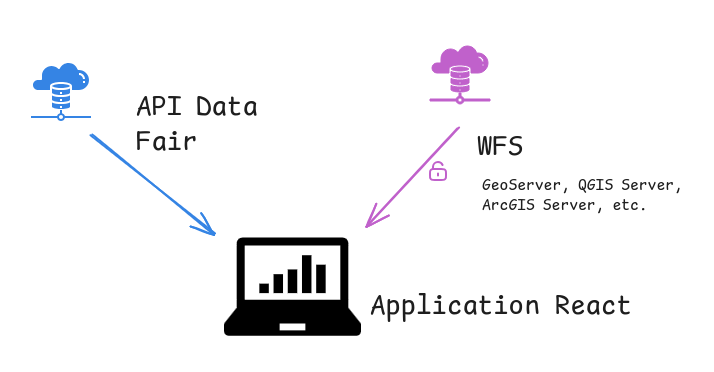
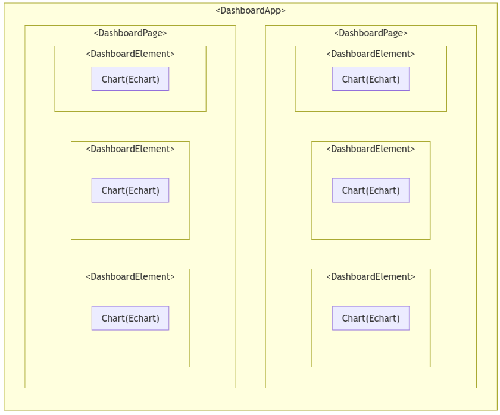
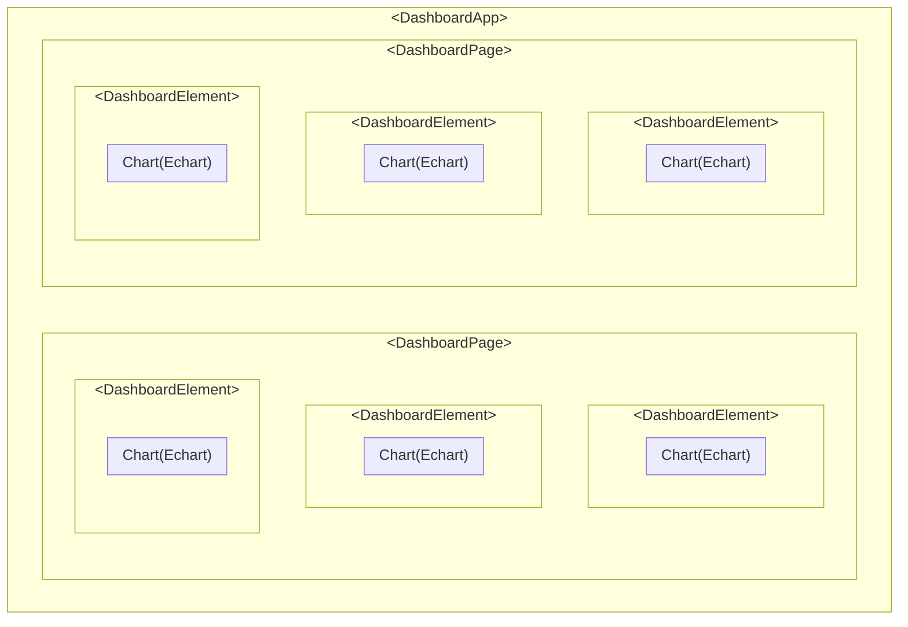

# API-Dashboard

Collection de composants React pour faciliter la création de **tableaux de bords territoriaux**.

Le projet permet la mise en place d'un tableau de bord facile à déployer sur une **infrastucture légère**.
Le tableau de bord, une fois compilé, peut-être mis à disposition des utilisateurs via un **simple server web** (HTTP/HTTPS) sans configuration particulière.
Il s'agit d'une application React (Javascript) s'executant dans le navigateur des utilisateurs. Il n'y a pas **backend à installer**,
l'application récupère les données via API **auprès d'un partenaire** (plateforme régionale, portail open-data, etc.) ou sur **votre serveur de données**.
Les données sont ensuites traitées par le client et présentées à l'utilisateur via des graphiques ou cartes.

Si des données sensibles alimentent un tableau de bord, l'authentification et la sécurité sont gérées au niveau du serveur de données. C'est donc 
lui qui va s'assurer que l'utilisateur a un droit d'accès aux données. L'application peut donc tout être utilisée pour présenter
des données sensibles ou même des graphiques dont les données diffèrent selon les droits de l'utilisateur.

Les API suivantes sont actuellement supportées (interrogation, filtre, pagination, etc. ) :
- [WFS](src/data_providers/wfs/) : API proposée par la plupart des serveurs geographiques (QGIS Server, GeoServer, ArcGIS server, etc.)
- [Data Fair](src/data_providers/datafair/) : API de la solution open source Data Fair.
- En développement : OGC API Features, TJS



En bref : 

- ✅ Déploiement facile et rapide (_client side_)
- ✅ Présentez au même endroit des données tierces, vos données et celles de vos partenaires
- ✅ Possibilité de visualiser des données sensibles
- ✅ Flexibilité

Les composants sont actuellement utilisés pour le [tableau de bord de l'Odema](https://github.com/geo2france/odema-dashboard).


## Utilisation

### Approche déclarative

Le tableau de bord est construit de manière déclarative **JSX** (accronyme de JavaScript XML).
Comme son nom l'indique, il permet de combiner la clarté et l'efficacité du XML, avec la souplesse et la puissance du JavaScript.

La construction du tableau de bord repose sur l'articulation de 3 grands concepts :

- Les `<Dataset>` permettent de rappatrier, filter et traiter laes données depuis des sources distantces (un portail open-data par exemple)
- Les graphiques `<ChartXXX>` et `<MapXXX>` constituent la partie essentiel du tableau de bord
- Les `<Control>` pour que les utilisateurs puissent interragir avec le tableau de bord (filter, activer/désactiver une option, etc.)

Il est possible d'ajouter des éléments dynamiques en Javascript.

```jsx
<Dashboard>

  <Dataset 
        id="dma_collecte_traitement" 
        resource="sinoe-(r)-destination-des-dma-collectes-par-type-de-traitement/lines"
        url="https://data.ademe.fr/data-fair/api/v1/datasets"
        type="datafair"
        pageSize={5000}>
        <Filter field="L_REGION">Hauts-de-France</Filter> 
        {/* Un filtre statique appliqué à l'API qui fournie les données */}

        <Filter field="ANNEE">{useControl('annee')}</Filter> 
        {/* Un second filtre : l'année choisie par l'utilisateur */}

        <Transform>SELECT [ANNEE], [L_TYP_REG_DECHET],  SUM([TONNAGE_DMA]) as [TONNAGE_DMA] FROM ? GROUP BY [ANNEE], [L_TYP_REG_DECHET]</Transform> 
        {/* Transformation local des données */}

        <Producer url="https://odema-hautsdefrance.org/">Odema</Producer>
        {/* Pour créditer les graphiques */}
  </Dataset>

  <Control>
      <NextPrevSelect name="annee" options={[{label:'2021', value:2021},{label:'2019', value:2019}]} />
  </Control>
  {/* Un control permettant à mon utilisateur de choisir l'année */}

  <ChartPie title={`Tonnages de déchets en ${useControl('annee')}`} dataset='dma_collecte_traitement' nameKey='L_TYP_REG_DECHET' dataKey='TONNAGE_DMA' />
  {/* Un graphique camembert standard. J'indique mon jeu de données et les colonnes à utiliser */}

</Dashboard>
```


### Développement de composant dataviz

La bibliothèque propose des graphiques de bases, mais il possible de développer ses propres composants React.
Des fonctions sont proposés afin d'aider le développeur dans cette tâche : accéder facilement aux données ou aux options utilisateurs, gestion des erreurs, etc.

Le développeur est libre d'utiliser bibliothèque dataviz ou carto de son choix, à partir du moment où le composant retourne un élément visuelle.
Nous préconisons [Echarts](https://echarts.apache.org) ou [Recharts](https://recharts.org/), mais il en existe une multitude.

`TODO : guide développement compsoant`

## Installation

Version de développment :
`npm install https://github.com/geo2france/api-dashboard/tarball/dev`

Version stable :
`npm install https://github.com/geo2france/api-dashboard/tarball/main`

## Documentation 

⭐ Essentiel  
👨‍💻 Utilisateur avancé 

### Mise en page et structure

- [DashboardApp](/src/components/Layout/) ⭐
- [DashboardPage](/src/components/DashboardPage/) ⭐
- [DashboardElement](/src/components/DashboardElement/) ⭐


### Composants 

- [KeyFigure](/src/components/KeyFigure/) ⭐
- [NextPrevSelect](/src/components/NextPrevSelect/) ⭐
- [MapLegend](/src/components/MapLegend/) ⭐
- [FlipCard](/src/components/FlipCard/)
- [LoadingContainer](/src/components/LoadingContainer/)

### Hooks et fonctions

- [useApi](/src/utils/README.MD) ⭐
- [useSearchParamsState](/src/utils/README.MD) ⭐
- [useChartEvents](/src/utils/README.MD) 👨‍💻
- [useChartActionHightlight](/src/utils/README.MD) 👨‍💻
- [useMapControl](/src/utils/README.MD) 👨‍💻
- [useChartExport](/src/utils/README.MD)

### Fournisseur de données

- [WFS](/src/data_providers/wfs/) ⭐
- [Datafair](/src/data_providers/datafair/) ⭐
- [Filte](/src/data_providers/file/) ⭐



<!---

--->