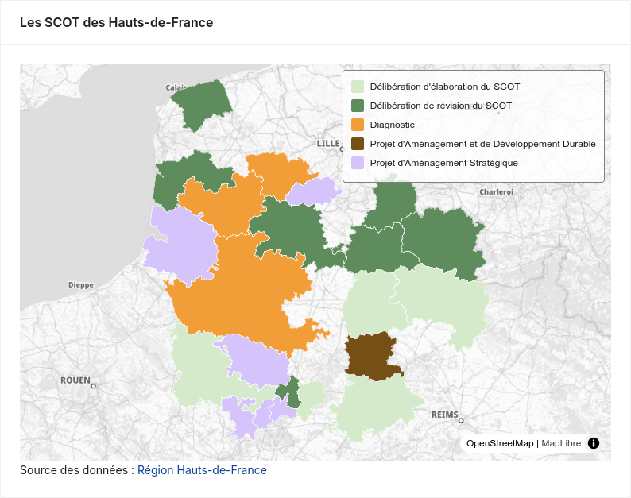

# Cartographie



## Propriétés

| Nom           | Type                      | Requis | Par défaut | Description |
|----------------|---------------------------|--------|------------|-------------|
| `dataset`      | `string`                  | ✳️      | —          | Identifiant du dataset à utiliser. |
| `categoryKey`  | `string`                  |       |          | Nom de la colonne contennant les catégories |
| `title  `     | `string`                  |        |          | Titre de la carte |
| `popup`  | `boolean`                  |        | `false`           | Afficher une popup au clic sur un élement. |
| `title`        | `string`                  |        |           | Titre du graphique. |
| `paint`        | `object`                 |        |     | Pour définir finement le style de la couche. Voir la  [documentation](https://maplibre.org/maplibre-style-spec/layers/#paint) de MapLibre. |
| `color`     | `string`        |        |           | Couleur du symbole (sinon définie à partir de la palette). Sans effet si `categoryKey` ou  `paint` sont définis.  |
| `xKey`     | `number`        |        |           | Colonne contenant la coordonnée x (longitude)  |
| `yKey`     | `number`        |        |           | Colonne contenant la coordonnée y (latitude)  |
| `popup`     | `bool`        |        |           | Afficher une popup au clique sur une entité |
| `popupFormatter`   | `function`    |        |    | Personnaliser le contenu de la popup (exemple : `(p) =>  <span>Valeur principale : {p.value}, autre valeur {p.row.area_code}</span>` )|

Si le dataset provient d'un flux WFS, la géométrie est automatiquement utilisée. Sinon il faut renseigner les propriétés _xKey_ et _yKey_.

## Exemple

```tsx
import { Dashboard, Dataset, Map, Palette, Producer } from "@geo2france/api-dashboard/dsl"
<Dashboard debug>
    <Palette steps={['#D5C3FB','#5E8C5C','#D4EACA','#F19E38','#745017']}/>
    <Dataset 
        id='scot'
        resource="scot_en_cours"
        url='https://qgisserver.hautsdefrance.fr/cgi-bin/qgis_mapserv.fcgi?MAP=/var/www/data/qgis/applications/limites_admin.qgz'
        type='wfs'
        pageSize={50}
        meta={{srsname:'EPSG:4326'}}
        >
        <Producer url="https://opendata.hautsdefrance.fr/dataset/ee965118-2416-4d48-b07e-bbc696f002c2">Région Hauts-de-France</Producer>
    </Dataset>

    <Map dataset="scot" categoryKey="etat_proc" title="Les SCOT des Hauts-de-France"/>

</Dashboard>
```

```tsx
import { Dashboard, Dataset, Map, Palette, Producer } from "@geo2france/api-dashboard/dsl"
<Dashboard debug>
    <Palette steps={['#D5C3FB','#5E8C5C','#D4EACA','#F19E38','#745017']}/>
    <Dataset 
        id="points_apport"
        type="datafair"
        resource="donnees-eo-ocab/lines"
        url="https://data.pointsapport.ademe.fr/data-fair/api/v1/datasets"
        pageSize={500}
    >
        <Producer url="https://data.pointsapport.ademe.fr/datasets/donnees-eo-ocab">OCAB</Producer>
    </Dataset>

    <Map dataset="points_apport"
         categoryKey="type_de_point_de_collecte" 
         title="Les points de collecte" 
         xKey="longitudewgs84" 
         yKey="latitudewgs84"/>

</Dashboard>
```