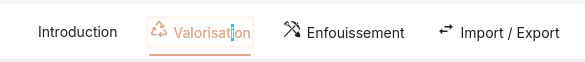
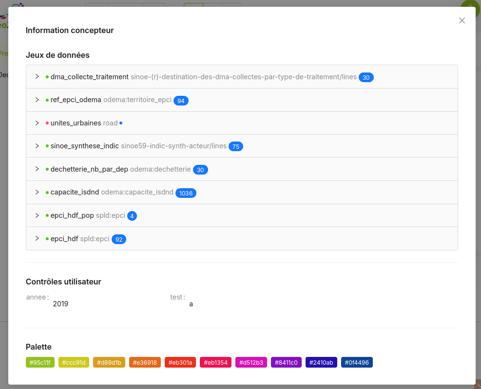

# Page

Une page est de tableau de bord est rendue par le composant `<Dasbhoard>`.

Cette page va contenir :

- Des jeux de données (`<Dataset>`)
- Une barre de contrôles utilisateurs (`<Control>`)
- Et bien sûr des _dataviz_ et/ou cartographies !

```jsx
// Exemple minimaliste. On affiche un camenbert à partir d'un jeu de données 
// proposé par l'ADEME sur son portail open-data

import  { Dashboard, Dataset, Control, ChartPie } from "@geo2france/api-dashboard"

export const MaPremierePage = () => (

  <Dashboard debug>

    <Dataset 
          id="dma_collecte_traitement" 
          resource="sinoe-(r)-destination-des-dma-collectes-par-type-de-traitement/lines"
          url="https://data.ademe.fr/data-fair/api/v1/datasets"
          type="datafair"
          pageSize={5000}>
    </Dataset>

    <Control>
          <Select name="annee" options={[2021,2019,2017]} initial_value={2019} arrows={true} />
    </Control>

    <ChartPie 
        title="Tonnages de déchets" 
        dataset='dma_collecte_traitement' 
        nameKey='L_TYP_REG_DECHET' 
        dataKey='TONNAGE_DMA' />

  </Dashboard>
)
```

## Sections

Les éléments visuels (graphiques et cartes) peuvent être regroupés en `<Section>`. 
L'ajout d'au moins deux sections ajoutera également une barre de navigation.

Les `<Section>` ne doivent contenir que des éléments visuels pas de `<Dataset>` ou `<Control>` 
car ceux-ci sont communs à toute la page.


```tsx
<Dashboard>

      {/* Dataset, contrôles, palette*/}

      <Section title="Import / Export" icon="mdi:exchange">
            {/* Graphiques et carto*/}
      </Section>
      
      <Section title="Section 2">
            {/* Graphiques et carto*/}
      </Section>
</Dashboard>
```

## Palette graphique

L'ajout d'une palette permet de personnaliser les couleurs utilisées par les graphiques de la page.
La palette est un gradient de couleur définie à partir de 2 couleurs ou plus.
Les graphiques utilisent ensuite des couleurs réparties de façon optimale le long de ce gradient.

La palette s'applique à l'ensemble de la page.

```tsx
<Dasbhoard>
      <Palette steps={['#95c11f','#ed1c24','#0f4496']} />
      {/* ... */}
</Dasbboard>
```


## Debug

L'ajout de la propriété `debug` au composant `<Dashboard>` ajoute un bouton dans le coin supérieur droit, 
permettant d'afficher différentes informations utiles (jeux de données chargés, contrôles utilisateurs, etc.).

Idéalement, à retirer dans la version en production.

