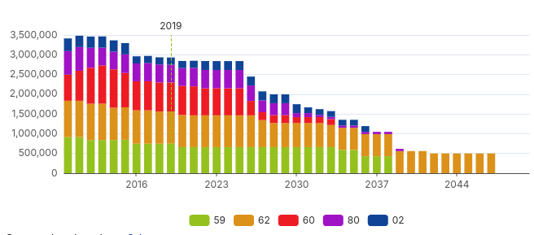
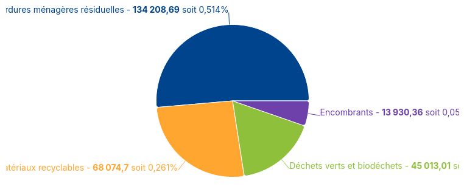

# Charts

Graphiques standards prêts à être utilisés.

## SerieYear

Représentation de séries annuelles.


| Nom           | Type                      | Requis | Par défaut | Description |
|----------------|---------------------------|--------|------------|-------------|
| `dataset`      | `string`                  | ✳️      | —          | Identifiant du dataset à utiliser. |
| `yearKey`      | `string`                  | ✳️      | —          | Nom de la colonne contennant l'année. |
| `valueKey`     | `string`                  | ✳️      | —          | Nom de la colonne contenant la valeur numérique |
| `categoryKey`  | `string`                  |        | —          | Colonne pour grouper les données par catégorie (ex : type, secteur...). |
| `title`        | `string`                  |        | —          | Titre du graphique. |
| `stack`        | `boolean`                 |        | `false`    | Empile les séries si plusieurs catégories sont présentes. |
| `yearMark`     | `number \| string`        |        | —          | Année à mettre en évidence (ex : `2021` ou `useControl('annee')` ) |
| `type`         | `'bar' \| 'line' \| 'area'` |        | `'line'` | Type de graphique à afficher. |



## Pie

Graphique "camembert".
Si des catégories sont dupliquées, les valeurs de celles-ci sont automatiquement sommées.

| Nom        | Type         | Requis | Par défaut | Description                                                                 |
|------------|--------------|--------|------------|-----------------------------------------------------------------------------|
| `dataset`  | `string`     | ✳️     | —          | Identifiant du dataset à utiliser.                                          |
| `dataKey`  | `string`     | ✳️     | —          | Nom de la colonne contenant les valeurs numériques à représenter.           |
| `nameKey`  | `string`     | ✳️     | —          | Nom de la colonne contenant les catégories (libellés des parts).            |
| `donut`    | `boolean`    |      | `false`    | Affiche le graphique en style **donut** (camembert avec un trou central).   |
| `unit `    | `string `    |      |            | Unité à afficher (ex: _%_, _kg_, etc.)   |
| `title `   | `string `    |      |            | Titre du graphique |

```jsx
<Dashboard>
    <Dataset 
        id="dma_collecte_traitement" 
        resource='sinoe-(r)-destination-des-dma-collectes-par-type-de-traitement/lines'
        url="https://data.ademe.fr/data-fair/api/v1/datasets"
        type='datafair'
        pageSize={5000}>
        <Filter field='L_REGION'>Hauts-de-France</Filter>
        <Filter field='L_TYP_REG_DECHET' operator='ne'>Encombrants</Filter>
        <Filter field='ANNEE'>{useControl('annee')}</Filter>
        <Transform>SELECT [L_TYP_REG_DECHET], [ANNEE], [C_DEPT], SUM([TONNAGE_DMA]) as [TONNAGE_DMA] FROM ? GROUP BY [ANNEE], [C_DEPT], [L_TYP_REG_DECHET]</Transform>
        <Transform>{(data) => data.map(row=>({pouette:4, ...row}))}</Transform>
        <Producer url="https://www.sinoe.org">Ademe</Producer>
        <Producer url="https://odema-hautsdefrance.org/">Odema</Producer>
    </Dataset>

    <ChartPie 
        // Identifiant du dataset (obligatoire si plusieurs dataset)
        dataset="destination-dma" 
        // Colonne qui contient les valeurs numériques
        dataKey='TONNAGE_DMA' 
        // Colonne qui contient les catégories
        nameKey='L_TYP_REG_DECHET'
        // Variante "donut" (trou central)
        donut 
    />

</Dashboard>
```

