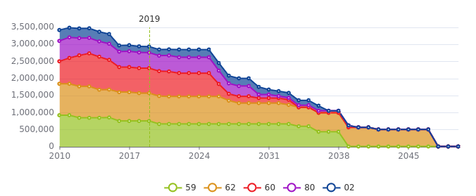

# Palette

Ajouter un composant `<Palette>` dans un tableau de bord permet de personnaliser les couleurs de l'ensemble des graphiques.

Pour l'instant, une seule palette est supporté.


## Composant Palette

Composant React permettant à l'utilisateur de **définir dynamiquement une palette de couleurs** (gradient) via un contexte partagé.

Il enregistre la palette dans le `PaletteContext`, ce qui permet à d'autres composants de l'application d'y accéder.

### Props

- `steps` (_string[]_)  
  Liste de couleurs (`hex`, `rgb`, `hsl`, etc.) qui seront utilisées pour générer le gradient.
  Il peux s'agit de [couleurs nommées](https://htmlcolorcodes.com/color-names/) ou code hexadécimaux.

- `mode` (_string_)  **optionnel** 
  Mode d’interpolation des couleurs (ex: `'hsl'`, `'lab'`, `'rgb'`).  
  Détermine comment les couleurs sont mélangées entre elles dans le gradient.  
  Par défaut : `'hsl'` pour une interpolation perceptuelle douce.

### Exemple
```jsx
<Dashboard>
      <Palette steps={['#95c11f','#ed1c24','#0f4496']} />
      <PalettePreview />  {/* Pour prévisualiser ma palette*/}
      
      {/*...*/}
</Dashboard>
```

## PalettePreview

Pour conception ou débug, offre un apperçu visuelle de la palette courante.


## usePalette

Un hook permet d'accéder facilement aux couleurs de la palette courante.
Il sera surtout utile aux développeurs souhaitant développer leurs propres graphiques.

Les couleurs sont prélevées de manière équidistante sur le gradient. Pour optimiser la distinction des couleurs, il faut donc récupérer exactement le nombre de couleurs nécessaires au graphique.

### Paramètres

- `nColors` (_number_, optionnel)  
  Nombre de couleurs interpolées à générer.  

### Exemple

```jsx
const myColors = usePalette({nColors:10}) //["#95c11f","#ccc91d","#d89d1b","#e36918","#eb301a","#eb1354","#d512b3","#8411c0","#2410ab","#0f4496"]
```

